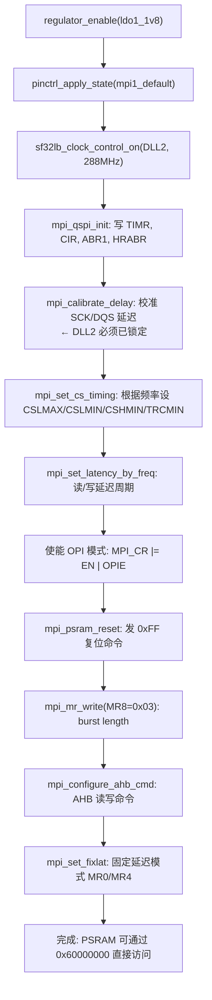

# SF32LB52 PSRAM 注册机制分析

> 基于实际代码追踪，2026-06-28。

---

## 1. 概述

PSRAM 的注册在 Zephyr 中分为两个独立的层次：

| 层 | DTS compatible | 作用 | 产物 |
|----|---------------|------|------|
| **硬件初始化** | `sifli,sf32lb-mpi-opi-psram` | 初始化 MPI 控制器，让 CPU 能访问 PSRAM | `DEVICE_DT_INST_DEFINE` → POST_KERNEL 阶段运行 |
| **链接器区域** | `zephyr,memory-region` | 告诉链接器这块地址可以放数据/代码 | 链接器脚本 MEMORY 区域 + 输出段 |

两层通过 devicetree 解耦，互不依赖。

### 1.1 本质：SiP 合封 PSRAM，与外部 PSRAM 完全不同

SF32LB525UC6 的 PSRAM 是 **SiP (System-in-Package) 合封**的——PSRAM die 和 MCU die
封装在同一个模组内，OPI 信号通过内部 bond wire 连接，不占用任何外部引脚。

这与 STM32 FMC/SDRAM/NOR 那种外部 PSRAM 有本质区别：

| 特性 | SF32LB52 SiP PSRAM | 典型外部 PSRAM (如 STM32+FMC) |
|------|-------------------|-------------------------------|
| 物理连接 | 内部 bond wire，零外部引脚 | 占用 20~40 个 IO 引脚 |
| 映射方式 | MPI 控制器自动 AHB 映射到 `0x60000000` | 需配置 FMC 时序寄存器 |
| 容量 | 芯片型号固定 (525=8MB, 527=16MB) | 可更换不同容量颗粒 |
| 初始化 | 厂商驱动一键完成，APP 无需干预 | 需按颗粒 datasheet 配时序 |
| 生命周期 | 上电即保持，无需睡眠/唤醒管理 | 可能需要动态电源管理 |
| 引脚复用 | 不冲突（内部引脚） | 和 LCD/摄像头等外设抢 IO |

**对应用开发者的含义**：

1. **`0x60000000` 是自动映射的**——和 Flash 空间一样，MPI 控制器在硬件层面将 PSRAM
   暴露为 AHB 从设备，CPU 通过总线直接读写。不需要手动配置 MPU/MMU。

2. **MPI1 是黑盒**——`sifli,sf32lb-mpi-opi-psram` 是 SiFli 提供的厂商驱动，
   校准延迟、配置时序等细节全部封装在 `memc_sf32lb_mpi_opi_psram_init()` 中。
   APP 代码不需要也不应该直接操作 MPI1 寄存器。

3. **不需要电源管理**——合封 PSRAM 随 MCU 一同上电，APP 生命周期内始终可用。
   HAL 层虽然有 `HAL_MPI_PSRAM_SLEEP/WAKEUP/DPD` 等函数，但 Zephyr 驱动并未暴露
   这些接口——因为合封场景下没有断电需求。

4. **`psram@60000000` 节点只服务于链接器**——它的唯一作用是让链接器知道"这里有
   8MB RAM 可以用"。如果不打算通过链接器放 `.data/.bss` 到 PSRAM，甚至可以删掉
   这个节点，运行时照样可以直接 `*(uint32_t *)0x60000000` 访问。

---

## 2. 完整文件索引

```
zephyr/
├── dts/
│   └── bindings/
│       ├── base/
│       │   └── zephyr,memory-region.yaml          ← 通用内存区域绑定
│       └── memory-controllers/
│           └── sifli,sf32lb-mpi-opi-psram.yaml    ← MPI OPI PSRAM 绑定
├── drivers/
│   └── memc/
│       └── memc_sf32lb_mpi_opi_psram.c            ← PSRAM 硬件驱动
├── include/
│   └── zephyr/
│       ├── linker/
│       │   └── devicetree_regions.h               ← 链接器区域/段自动生成宏
│       └── arch/
│           └── arm/
│               └── cortex_m/
│                   └── scripts/
│                       └── linker.ld              ← Cortex-M 链接器脚本
└── dts/
    └── arm/
        └── sifli/
            ├── sf32lb52x.dtsi                     ← mpi1 默认节点
            └── sf32lb52x-ram012.dtsi              ← 片上共享内存示例

application/
└── boards/
    └── sifli/
        └── sf32lb52_hspi/
            └── sf32lb52_hspi.dts                  ← 板级覆盖 & psram 区域声明
```

---

## 3. 第一层：硬件初始化

### 3.1 DTS 绑定

**文件**: `zephyr/dts/bindings/memory-controllers/sifli,sf32lb-mpi-opi-psram.yaml`

```yaml
compatible: "sifli,sf32lb-mpi-opi-psram"

include: [base.yaml, pinctrl-device.yaml]

properties:
  reg:
    required: true
    description: |
      Memory-mapped addresses for MPI controller and PSRAM memory region.
      First entry is the MPI controller registers, second is the PSRAM
      memory-mapped region.

  reg-names:
    required: true
    description: |
      Names for the reg entries. Must be "ctrl" and "psram".

  clocks:
    required: true

  power-supply:
    type: phandle
```

### 3.2 板级 DTS 声明

```dts
&mpi1 {
    compatible = "sifli,sf32lb-mpi-opi-psram";
    reg = <0x50041000 0x1000>, <0x60000000 DT_SIZE_M(8)>;
    reg-names = "ctrl", "psram";
    pinctrl-0 = <&mpi1_default>;
    pinctrl-names = "default";
    power-supply = <&ldo1_1v8>;
    status = "okay";
};
```

### 3.3 `mpi1` 默认节点

**文件**: `zephyr/dts/arm/sifli/sf32lb52x.dtsi` (第 132 行)

```dts
mpi1: memory-controller@50041000 {
    /*
     * Configure compatible depending on memory type, choices:
     * - sifli,sf32lb-mpi-qspi-nor (for external NOR flash)
     * - sifli,sf32lb-mpi-opi-psram (for internal OPI PSRAM)
     *
     * For chips with internal PSRAM (523/525/527/52e/52g/52j),
     * configure as OPI PSRAM with appropriate size:
     * - 523/52e: 4MB
     * - 525/52g: 8MB
     * - 527/52j: 16MB
     */
    reg = <0x50041000 0x1000>, <0x10000000 DT_SIZE_M(32)>;
    reg-names = "ctrl", "psram";
    clocks = <&rcc_clk SF32LB52X_CLOCK_MPI1>;
    #address-cells = <1>;
    #size-cells = <0>;
    status = "disabled";
};
```

> 板级 DTS 通过 `&mpi1 { compatible = "sifli,sf32lb-mpi-opi-psram"; }` 覆盖默认值。

### 3.4 驱动注册宏

**文件**: `zephyr/drivers/memc/memc_sf32lb_mpi_opi_psram.c` (第 548-570 行)

```c
#define DT_DRV_COMPAT sifli_sf32lb_mpi_opi_psram

#define MEMC_SF32LB_MPI_OPI_PSRAM_INIT(n)                                    \
    PINCTRL_DT_INST_DEFINE(n);                                                \
    static struct memc_sf32lb_mpi_opi_psram_data data_##n;                    \
    static const struct memc_sf32lb_mpi_opi_psram_config config_##n = {       \
        .mpi_base    = DT_INST_REG_ADDR_BY_NAME(n, ctrl),                     \
        .psram_base  = DT_INST_REG_ADDR_BY_NAME(n, psram),                    \
        .size        = DT_INST_REG_SIZE_BY_NAME(n, psram),                    \
        .clock       = SF32LB_CLOCK_DT_INST_SPEC_GET(n),                      \
        .pcfg        = PINCTRL_DT_INST_DEV_CONFIG_GET(n),                     \
        .power_supply = COND_CODE_1(                                          \
            DT_INST_NODE_HAS_PROP(n, power_supply),                           \
            (DEVICE_DT_GET(DT_INST_PHANDLE(n, power_supply))),                \
            (NULL)),                                                           \
    };                                                                         \
    DEVICE_DT_INST_DEFINE(n, memc_sf32lb_mpi_opi_psram_init, NULL,           \
                  &data_##n, &config_##n, POST_KERNEL,                        \
                  CONFIG_MEMC_INIT_PRIORITY, NULL);

DT_INST_FOREACH_STATUS_OKAY(MEMC_SF32LB_MPI_OPI_PSRAM_INIT)
```

- `DT_INST_FOREACH_STATUS_OKAY` 遍历所有 `status = "okay"` 的实例
- 为每个实例生成 `DEVICE_DT_INST_DEFINE`
- 设备在 `POST_KERNEL` 阶段初始化

### 3.5 初始化流程



**关键点**:
- MPI 时钟源是 DLL2 (288 MHz)，OPI 频率 = 144 MHz
- 校准步骤依赖 DLL2 已锁定，初始化前等待 200 µs
- 固定延迟模式下，根据 OPI 频率计算 `r_lat = w_lat × 2`

### 3.6 配置结构体

```c
struct memc_sf32lb_mpi_opi_psram_config {
    uintptr_t mpi_base;               // MPI 控制器寄存器基址 (0x50041000)
    uintptr_t psram_base;             // PSRAM 内存映射基址 (0x60000000)
    uint32_t size;                    // PSRAM 大小 (8MB)
    struct sf32lb_clock_dt_spec clock; // 时钟 (DLL2)
    const struct pinctrl_dev_config *pcfg;
    const struct device *power_supply; // LDO1_1V8
};

struct memc_sf32lb_mpi_opi_psram_data {
    uint8_t sck_delay;   // 校准后的 SCK 延迟
    uint8_t dqs_delay;   // 校准后的 DQS 延迟
    uint8_t rd_latency;  // 读延迟周期
    uint8_t wr_latency;  // 写延迟周期
};
```

---

## 4. 第二层：链接器内存区域

### 4.1 DTS 绑定

**文件**: `zephyr/dts/bindings/base/zephyr,memory-region.yaml`

```yaml
description: Compatible for devices resulting in linker memory regions

compatible: "zephyr,memory-region"

include: [base.yaml, "zephyr,memory-common.yaml"]

properties:
  zephyr,memory-region:
    required: true
```

### 4.2 板级 DTS 声明

```dts
psram: psram@60000000 {
    compatible = "zephyr,memory-region";
    reg = <0x60000000 DT_SIZE_M(8)>;
    zephyr,memory-region = "PSRAM";
    zephyr,memory-attr = <(DT_MEM_ARM(ATTR_MPU_RAM))>;
};
```

> **注意**: 这个节点**不创建任何设备驱动**，只影响链接器脚本。

### 4.3 链接器脚本生成

**文件**: `zephyr/include/zephyr/linker/devicetree_regions.h`

#### MEMORY 区域生成 (`LINKER_DT_REGIONS()`)

```c
#define _REGION_DECLARE(node_id)                        \
    LINKER_DT_NODE_REGION_NAME_TOKEN(node_id)           \
    LINKER_DT_NODE_REGION_FLAGS(node_id)                \
        : ORIGIN = DT_REG_ADDR(node_id),                \
          LENGTH = DT_REG_SIZE(node_id)

#define LINKER_DT_REGIONS() \
    DT_FOREACH_STATUS_OKAY(zephyr_memory_region, _REGION_DECLARE)
```

展开结果：

```ld
/* psram@60000000 节点 → zephyr,memory-region = "PSRAM" */
PSRAM (rw) : ORIGIN = 0x60000000, LENGTH = 0x800000
```

#### 输出段生成 (`LINKER_DT_SECTIONS()`)

```c
#define _SECTION_DECLARE(node_id)                                   \
    LINKER_DT_NODE_REGION_NAME_TOKEN(node_id) (NOLOAD) :            \
    {                                                                \
        __PSRAM_start = .;                                           \
        KEEP(*(PSRAM))                                               \
        KEEP(*(PSRAM.*))                                             \
        __PSRAM_end   = .;                                           \
    } > PSRAM                                                        \
    __PSRAM_size      = __PSRAM_end - __PSRAM_start;                 \
    __PSRAM_load_start = LOADADDR(PSRAM);
```

### 4.4 链接器脚本入口

**文件**: `zephyr/include/zephyr/arch/arm/cortex_m/scripts/linker.ld` (第 411 行)

```ld
/* Sections generated from 'zephyr,memory-region' nodes */
LINKER_DT_SECTIONS()
```

### 4.5 C 代码中使用 PSRAM

```c
// 方法1：section 属性 — 将变量放入 PSRAM 段
int __attribute__((__section__("PSRAM"))) big_buffer[1024 * 1024];

// 方法2：用链接器导出的符号
extern char __PSRAM_start[];
extern char __PSRAM_end[];
extern char __PSRAM_size[];

void *psram_ptr = (void *)__PSRAM_start;
size_t psram_bytes = (size_t)__PSRAM_size;

// 方法3：直接访问内存映射地址 (驱动初始化后即可用)
#define PSRAM_BASE 0x60000000
volatile uint32_t *psram = (volatile uint32_t *)PSRAM_BASE;
psram[0] = 0xDEADBEEF;
```

---

## 5. 两层的关系

```
                    DTS 树
                      │
        ┌─────────────┴─────────────┐
        ▼                           ▼
 &mpi1 {                     psram@60000000 {
   compatible =                compatible =
     "sifli,sf32lb-              "zephyr,memory-region";
     mpi-opi-psram";             zephyr,memory-region
   status = "okay";              = "PSRAM";
 }                           };
        │                           │
        ▼                           ▼
  memc_sf32lb_mpi_            LINKER_DT_REGIONS()
  opi_psram_init()            LINKER_DT_SECTIONS()
        │                           │
        ▼                           ▼
  POST_KERNEL 阶段              链接时
  初始化 MPI 控制器              生成 PSRAM 内存区域
  使能 PSRAM 硬件                生成 PSRAM 输出段
        │                           │
        └───────────┬───────────────┘
                    ▼
          运行时: CPU 可通过 0x60000000
          直接读写 PSRAM，链接器知道
          可以将 .data/.bss/自定义段
          放入这块区域
```

**时序依赖**: PSRAM 硬件初始化发生在 `POST_KERNEL` 阶段（晚于内核启动），因此在 `memc_sf32lb_mpi_opi_psram_init()` 完成之前，不能访问 PSRAM。如果需要在更早阶段使用 PSRAM（比如放 `.data` 段），需要调整初始化优先级。

---

## 6. 片上共享内存对比

**文件**: `zephyr/dts/arm/sifli/sf32lb52x-ram012.dtsi`

```dts
sram0_shared: memory@2007fc00 {
    compatible = "zephyr,memory-region", "mmio-sram";
    reg = <0x2007fc00 DT_SIZE_K(1)>;
    zephyr,memory-region = "sram0_shared";
    zephyr,memory-attr = <DT_MEM_ARM(ATTR_MPU_RAM_NOCACHE)>;
};

sram1_shared: memory@20400000 {
    compatible = "zephyr,memory-region", "mmio-sram";
    reg = <0x20400000 DT_SIZE_K(64)>;
    zephyr,memory-region = "sram1_shared";
    zephyr,memory-attr = <DT_MEM_ARM(ATTR_MPU_RAM_NOCACHE)>;
};
```

与 PSRAM 的关键区别：
- 片上 SRAM 不需要硬件初始化驱动（上电即可用）
- `compatible` 包含 `"mmio-sram"` 用于 MPU 配置
- `zephyr,memory-attr` 设为 `NOCACHE`（多核共享需要）

---

## 7. 关键配置项

| Kconfig | 作用 |
|---------|------|
| `CONFIG_MEMC` | 启用 MEMC 驱动子系统 |
| `CONFIG_MEMC_INIT_PRIORITY` | MPI PSRAM 驱动初始化优先级 |
| `CONFIG_MEMC_LOG_LEVEL` | 驱动日志级别 |
| `CONFIG_REGULATOR` | 需要启用以自动使能 `ldo1_1v8` |
| `CONFIG_PINCTRL` | 需要启用以配置 MPI1 引脚 |

---

## 8. 调试与验证

```c
// 检查驱动是否初始化成功
const struct device *mpi_dev = DEVICE_DT_GET(DT_NODELABEL(mpi1));
if (!device_is_ready(mpi_dev)) {
    printk("MPI1 PSRAM driver not ready!\n");
}

// 验证 PSRAM 可读写
volatile uint32_t *test = (volatile uint32_t *)0x60000000;
uint32_t pattern = 0xA5A5A5A5;
test[0] = pattern;
if (test[0] != pattern) {
    printk("PSRAM readback failed!\n");
}
```

---

## 9. 黑盒透视：驱动源码中的硬件细节

> 源码: `zephyr/drivers/memc/memc_sf32lb_mpi_opi_psram.c`

在传统国产 MCU SDK 中，PSRAM 初始化序列通常编译为闭源 `.a` 静态库或直接固化在
ROM bootloader 中，开发者只能看到 `.h` 里的函数声明。SiFli 在 Zephyr 中将其完整
开源为 C 代码，这非常罕见，也让我们能一窥 MPI 控制器和 OPI PSRAM 的硬件工作机制。

### 9.1 自动校准电路

硬件内置了自动延迟校准引擎，通过 `CALCR` 寄存器控制（第 126-178 行）：

```c
/* 先把 prescaler 设成 2，让时钟慢下来 */
sys_write32(2U, mpi + MPI_PSCLR);

/* 关 SCK 反相 */
miscr &= ~MPI_MISCR_SCKINV_Msk;
sys_write32(miscr, mpi + MPI_MISCR);

/* 使能校准 */
sys_set_bit(mpi + MPI_CALCR, MPI_CALCR_EN_Pos);

/* 等 DONE 标志（超时 ~1ms） */
while (!(sys_read32(mpi + MPI_CALCR) & MPI_CALCR_DONE)) {
    if (--retries <= 0) {
        /* DLL2 没锁？芯片坏了？bond wire 断了？ */
        return -ETIMEDOUT;
    }
    mpi_delay_us(1);
}

/* 读回校准结果 */
delay = sys_read32(mpi + MPI_CALCR) & MPI_CALCR_DELAY_Msk;

/* 检查有效性 */
if (delay < 4) {
    LOG_ERR("MPI calibration result too small: %u", delay);
    return -EINVAL;  // PSRAM 没响应
}

/* 计算实际延迟值 */
data->sck_delay = (uint8_t)(delay - 1);
data->dqs_delay = (uint8_t)(delay - 4);
```

**关键发现**:
- MPI 控制器**内置硬件校准电路**，自动扫描延迟线找到最优采样点
- 校准依赖 DLL2 已锁定——如果 DLL2 没锁，`CALCR_DONE` 永远不会置位
- `delay < 4` 意味着 PSRAM 根本没响应（DQS 没有正确返回）
- `sck_delay = delay - 1` 和 `dqs_delay = delay - 4` 是经验公式，反映 SCK 和 DQS
  的相位关系

这个 `CALCR` 寄存器在闭源 SDK 里你根本不知道它存在——文档大概率不会写。

### 9.2 OPI PSRAM 命令集

驱动中直接定义了 JEDEC xSPI Octal PSRAM 标准命令（第 52-56 行）：

```c
#define OPSRAM_CMD_READ    0x00U   // 读
#define OPSRAM_CMD_WRITE   0x80U   // 写
#define OPSRAM_CMD_MRREAD  0x40U   // 读 Mode Register
#define OPSRAM_CMD_MRWRITE 0xC0U   // 写 Mode Register
#define OPSRAM_CMD_RESET   0xFFU   // 软件复位
```

手动命令发送函数 `mpi_manual_cmd()`（第 191-213 行）：

```c
static void mpi_manual_cmd(uintptr_t mpi, bool is_write,
    uint8_t dmode, uint8_t dcyc,     // 数据模式 + dummy 周期
    uint8_t abmode, uint8_t absize,  // 交替字节模式 + 大小
    uint8_t adsize, uint8_t admode,  // 地址大小 + 模式
    uint8_t imode)                    // 指令模式
{
    uint32_t ccr1 = 0U;
    ccr1 |= FIELD_PREP(MPI_CCR1_IMODE_Msk, imode);
    ccr1 |= FIELD_PREP(MPI_CCR1_ADMODE_Msk, admode);
    ccr1 |= FIELD_PREP(MPI_CCR1_ADSIZE_Msk, adsize);
    ccr1 |= FIELD_PREP(MPI_CCR1_ABMODE_Msk, abmode);
    ccr1 |= FIELD_PREP(MPI_CCR1_ABSIZE_Msk, absize);
    ccr1 |= FIELD_PREP(MPI_CCR1_DCYC_Msk, dcyc);
    ccr1 |= FIELD_PREP(MPI_CCR1_DMODE_Msk, dmode);
    if (is_write) ccr1 |= MPI_CCR1_FMODE_Msk;
    sys_write32(ccr1, mpi + MPI_CCR1);
}
```

每个 SPI 事务的 6 个维度（指令/地址/交替字节/数据/模式/方向）都被参数化——这本质
上就是 MPI 控制器的 **SPI 事务描述符**。

### 9.3 PSRAM Mode Register 初始化序列

初始化过程写了 3 个 MR 寄存器（第 500-540 行）：

```c
/* MR8 = 0x03: burst length */
mpi_mr_write(dev, 8, 0x03);

/* MR0: 固定延迟模式下 bit5=1, rlat */
mr0 = (1U << 5) | (rlat_arr[r_lat / 2] << 2) | 1U;

/* MR4: wlat */
mr4 = (wlat_arr[w_lat] << 5);
```

| MR | 写入值 | 含义 |
|----|--------|------|
| MR0 | `(1<<5) \| (rlat<<2) \| 1` | 固定延迟使能 + 读延迟 + 驱动强度 |
| MR4 | `wlat << 5` | 写延迟 |
| MR8 | `0x03` | Burst length = 16 bytes (xSPI 固定) |

### 9.4 固定延迟模式下的延迟表

根据 OPI 频率查表确定延迟周期（第 504-530 行）：

```c
/* 写延迟：基于 OPI 频率 */
if      (psram_freq <=  66000000) w_lat = 3;
else if (psram_freq <= 109000000) w_lat = 4;
else if (psram_freq <= 133000000) w_lat = 5;
else if (psram_freq <= 166000000) w_lat = 6;
else                              w_lat = 7;

/* 读延迟 = 写延迟 × 2 */
r_lat = w_lat * 2;
```

**硬件含义**:

| OPI 频率 | w_lat | r_lat | 读延迟 (ns) |
|----------|-------|-------|------------|
| ≤ 66 MHz | 3 | 6 | ~91 ns |
| ≤ 109 MHz | 4 | 8 | ~73 ns |
| ≤ 133 MHz | 5 | 10 | ~75 ns |
| ≤ 166 MHz | 6 | 12 | ~72 ns |
| > 166 MHz | 7 | 14 | ~70 ns |

`r_lat = w_lat * 2` 这个规律说明 PSRAM 内部读路径的 pipeline 深度恰好是写路径的 2 倍。

### 9.5 CS 时序参数

根据 OPI 频率设置片选时序（第 343-370 行）：

```c
if (freq <= 24000000) {
    cs_max = 180;  cshmin = 0;  trcmin = 3;
} else if (freq <= 120000000) {
    cs_max = 950;  cshmin = 3;  trcmin = 14;
} else if (freq <= 144000000) {
    cs_max = 1140; cshmin = 5;  trcmin = 17;
} else {
    cs_max = 1330; cshmin = 8;  trcmin = 20;
}
```

| 参数 | 含义 | 单位 |
|------|------|------|
| `CSLMAX` | CS 低电平最大时间 | MPI 时钟周期 |
| `CSLMIN` | CS 低电平最小时间 (固定 6) | MPI 时钟周期 |
| `CSHMIN` | CS 高电平最小时间 | MPI 时钟周期 |
| `TRCMIN` | 两次命令间最小间隔 | MPI 时钟周期 |

这些参数防止 CS 拉低太久（PSRAM 会超时），同时保证命令间有足够的恢复时间。

### 9.6 AHB 自动翻译引擎——驱动的精髓

驱动的最终目标是配置 MPI 的 **AHB 自动翻译引擎**（第 313-340 行）：

```c
/* AHB 读命令: OPI 模式, 32-bit 地址, 无交替字节, dcYC = rd_lat-1 */
hrccr = FIELD_PREP(MPI_HRCCR_IMODE_Msk, CCR_MODE_OCT) |
        FIELD_PREP(MPI_HRCCR_ADMODE_Msk, CCR_MODE_OCT) |
        FIELD_PREP(MPI_HRCCR_ADSIZE_Msk, CCR_ADSIZE_32) |
        FIELD_PREP(MPI_HRCCR_ABMODE_Msk, CCR_MODE_NONE) |
        FIELD_PREP(MPI_HRCCR_DCYC_Msk, data->rd_latency - 1) |
        FIELD_PREP(MPI_HRCCR_DMODE_Msk, CCR_MODE_OCT);

/* AHB 写命令同理 */
hwccr = FIELD_PREP(MPI_HWCCR_IMODE_Msk, CCR_MODE_OCT) | ...

/* 读写命令码拼成一个 16-bit 值 */
hcmdr = OPSRAM_CMD_READ | (OPSRAM_CMD_WRITE << 8);
sys_write32(hcmdr, mpi + MPI_HCMDR);
```

**这就是整个驱动的最终目的**：配好 `HRCCR`（AHB 读命令配置）、`HWCCR`（AHB 写命令配置）、
`HCMDR`（命令码）之后，CPU 访问 `0x60000000` 时硬件自动做以下翻译：

```
CPU 执行:  ldr r0, [0x60001000]
           │
           ▼
MPI AHB 引擎自动生成 OPI 总线序列:
  CS↓ → CMD(0x00=READ) → ADDR(0x001000, 32-bit, OPI) → DQS↑ → DATA(8字节) → CS↑
           │
           ▼
CPU 得到:  r0 = PSRAM[0x1000] 的值
```

传统 SDK 中这段配置绝对是汇编写的（因为涉及精确时序），这里用 C 加 CMSIS
`FIELD_PREP` 宏就搞定了。`CCR_MODE_OCT` (=7) 表示 8 线 Octal SPI 模式，
`CCR_ADSIZE_32` (=3) 表示 32 位地址（支持最大 4GB 寻址）。

### 9.7 驱动初始化全貌

```
regulator_enable(ldo1_1v8)         // 1. 给 PSRAM 上电 (1.8V LDO)
    ↓ k_busy_wait(5000)
pinctrl_apply_state(mpi1_default)  // 2. 配置内部引脚 (SA00~SA12)
    ↓
clock_control_on(DLL2, 288MHz)     // 3. 使能 MPI1 时钟源
    ↓ k_busy_wait(200)            //    等 DLL2 锁相
mpi_qspi_init()                    // 4. 写 TIMR/CIR/ABR1/HRABR 初值
    ↓
mpi_calibrate_delay()              // 5. 硬件自动校准 SCK/DQS 延迟
    ↓
mpi_set_cs_timing()                // 6. 根据频率配 CS 时序参数
mpi_set_latency_by_freq()          // 7. 根据频率确定延迟周期
    ↓
MPI_CR |= EN | OPIE                // 8. 使能 MPI + OPI 模式
    ↓
mpi_psram_reset()                  // 9. 发 0xFF 软复位
    ↓ mpi_delay_us(3)
mpi_mr_write(8, 0x03)             // 10. MR8: burst length
    ↓
mpi_set_fixlat(..., r_lat, w_lat) // 11. MR0/MR4: 固定延迟模式
    ↓
mpi_configure_ahb_cmd()            // 12. 配置 AHB 自动翻译引擎
    ↓
sys_write32(0x1FFFF, MPI_WDTR)     // 13. 设看门狗超时
    ↓
完成 — PSRAM 可以通过 0x60000000 访问
```

总共 13 步，每一步都有明确的硬件目的。这个初始化序列在传统闭源 SDK 中通常是一个
不可见的 `ROM_PSRAM_Init()` 调用，现在完整展开成 C 代码。

